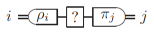
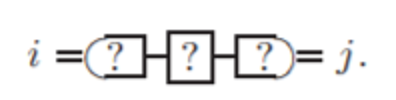

# Hypotheses and Circuits

## Hypothesis

A hypothesis is a statement which is assumed to be true. It can also predict certain _correlations_. Let's represent a hypothesis by $\mathcal{X}$

## Compatible Correlations

Correlations or observations which are explained by the hypothesis and do not contradict the hypothesis is known as the correlations compatible with the hypothesis.
Let's represent the set of correlations as $S(\mathcal{X})$.

## Falsification

A hypothesis is falsified when we observe something that is incorrectly predicted by the hypothesis. Mathematically, if $\exists x | x \notin S(\mathcal{X})$, then $\mathcal{X}$, and every other hypothesis $\mathcal{Y}$ such that $S(\mathcal{Y})\subseteq S(\mathcal{X})$, is falsified.

## Circuits

A Circuit is a sequence of channels which takes in a classical input and gives a classical output, but the channels it consists of may be quantum in nature. A Circuit is also _essentially_ a hypothesis. It hypothesizes that given some input $i$, it gives some output $j$ with probabilty $p_{i|j}$.

## Some Philosophy

The definition of hypothesis is so general, that the very existence of something itself is a hypothesis and hence every statement is a hypothesis.

. . . 

And, the whole point of Science is to find $x \notin S(\mathcal{X})$ and then to find $\mathcal{X'}$ such that $S(\mathcal{X}) \subset S(\mathcal{X'})$ and $x\in S(\mathcal{X'})$ and then some other dude will come and do that and so on and on...

# Tomography



## Tomography

1. Send in some classical input
2. Generate the quantum state from the classical input
3. Send the quantum state through the channel
4. Measure the changed state
5. Get the classical output
6. Do it again
7. And AGAIN!
8. Find $S(\mathcal{C})=p_{j|i}$
9. Find the channel of best fit

## Tomographic Corroboration

We give the ok to $\mathcal{C_T}$ if $\{p_{j|i}\}\in S(\mathcal{C_T})$, which means that the correlations can be explained by $\mathcal{C_T}$.

## The cyclicity of Tomography

. . .

In tomography, you assume that $\rho_i$ and $\pi_i$ are well known.

. . .

But how can you be sure? You must have then applied tomography on those. This sets up a cyclic dependency for tomography.

# The Solution

**Data Driven Inference Protocol**

---

### DDI Protocol

We aren't sure if $\rho_i$ and $\pi_j$ are working correctly or not. So why not assume that they don't work?

. . .

Hence, our _Circuit_ is going to look like this -



---

The crucial idea is that we extend the idea of corroboration so that the reconstruction of $\mathcal{C}$, $\mathcal{C_{DD}}$ to be corroborated by _any_ test that one may perform.

That is, _regardless_ of $\{\rho_{i}\}$ and $\{\pi_j\}$, $\{p_{j|i}\} \in S(\mathcal{C})$

This is clearly a stronger requirement. If a Channel is DDI corroborated, then it must also be tomographically corroborated.

---

## The process

More precisely, the DDI protocol consists of obtaining a reconstruction by collecting many correlations $\{p_{j|i}^{(k)}\}$ by using a family of $\{\rho_i^{(k)}\}_i$ and $\{\pi_j^{(k)}\}_j$. Then choose a reconstruction $\mathcal{C}_{DD}$ such that $\{p_{j|i}^{(k)}\} \in S(\mathcal{C_{DD}})$ for all k.

## Non Uniqueness of $S(\mathcal{C_{DD}})$

Obviously, for all $\mathcal{C_{DD}'}$ where $S(\mathcal{C_{DD}'}) \supseteq S(\mathcal{C_{DD}})$, the condition is still satisfied.

Hence, we choose the "minimal" reconstruction. That is, the channel that the correlations corroborate but can predict the least number of correlations apart from those.

---

Mathematically, if $\mathcal{D}$ is the set of all possible reconstructions,

$$
\mathcal{C}_{DD} := \underset
    {\substack
        {\mathcal{C}\in\mathcal{D}\\
        \{p_{j|i}^{(k)}\} \in S(\mathcal{C})
        }
    }
    {\operatorname{arg\ min}}
\text{Vol}(S(\mathcal{C}))
$$

Where $\text{Vol}$ is the volume of the set according to some metric.

## Summary

```
While in the data collection stage the experimentalist is assumed to have full knowledge of the apparatus (i.e., the states to prepare and the measurements to perform are known and trusted by the experimentalist), the inference stage does not require such a knowledge at all, as it uses only the correlations obtained without any reference about which states and measurements produced such correlations. In this sense, the narrative can be given as if a good experimentalist, perfectly knowing their laboratory, is trying to convince a very stubborn theoretician, who does not trust anything apart from the bare data, about the availability of a particular channel in their laboratory.
```

# The Quantum Case 

**of $\mathbb{D}_2$ covarient channels**

_Math and results_

## $\mathbb{D}_2$ covarient channels

Qubit dihedrally-covariant channels is a class of channels which contains the Pauli Matrices and the Amplitude dampening channels.

---

The action of the channel on the Qubit state can be represented as:
$$
\begin{align*}
   \frac{1}{2} \begin{pmatrix}
    \text{Tr}[\mathbb{I} \mathcal{C}(\mathbb{I})] &  \text{Tr}[\mathbb{I} \mathcal{C}(\sigma_{x})] & \text{Tr}[\mathbb{I} \mathcal{C}(\sigma_{y})] & \text{Tr}[\mathbb{I} \mathcal{C}(\sigma_{z})] \\
    \text{Tr}[\sigma_{x} \mathcal{C}(\mathbb{I})] & \text{Tr}[\sigma_{x} \mathcal{C}(\sigma_{x})] & \text{Tr}[\sigma_{x} \mathcal{C}(\sigma_{y})] & \text{Tr}[\sigma_{x} \mathcal{C}(\sigma_{z})] \\
     \text{Tr}[\sigma_{y} \mathcal{C}(\mathbb{I})] & \text{Tr}[\sigma_{y} \mathcal{C}(\sigma_{x})] & \text{Tr}[\sigma_{y} \mathcal{C}(\sigma_{y})] & \text{Tr}[\sigma_{y} \mathcal{C}(\sigma_{z})] \\
      \text{Tr}[\sigma_{z} \mathcal{C}(\mathbb{I})] & \text{Tr}[\sigma_{z} \mathcal{C}(\sigma_{x})] & \text{Tr}[\sigma_{z} \mathcal{C}(\sigma_{y})] & \text{Tr}[\sigma_{z} \mathcal{C}(\sigma_{z})]
    \end{pmatrix}
  \vec{v}_{\rho}^{T}
\end{align*}
$$

in the basis $\{\mathbb{I}, \sigma_{x}, \sigma_{y}, \sigma_{z} \}$. 

---

For $\mathbb{D}_2$ channels, this reduces to

$$
\mathcal{C} = \begin{bmatrix}
    1   & 0   & 0   & 0\\
    0   & d_1 & 0   & 0\\
    0   & 0   & d_2 & 0\\
    c_3 & 0   & 0   & d_3\\
\end{bmatrix}
$$

and they map the Bloch sphere into an ellipsoid with axes lengths $\vec{d}$ and translated by $c_3$.

## Parametrizing $S(\mathbb{D}_2)$

It turns out that $S(\mathcal{C})$ is given by

$$S(\mathcal{C}) = \text{conv }[(0,1), \epsilon]$$

and the $\text{Vol}$ is given by

$$
\text{Vol}(S(\mathcal{C})) = \begin{cases}
    d_3, & \text{if } d_2 \leq d_3\\
    d_3+\frac{d_2^2 c_3}{\sqrt{d_2^2-d_3^2}}\arcsin{\frac{\sqrt{d_2^2-d_3^2}}{d_2}}, & \text{otherwise}
\end{cases}
$$

---

It can be shown that  among the parameters $\vec{d}$ and $c_3$ that characterize any given $\mathbb{D}_2$-covariant channel $\mathcal C$, which ones can be reconstructed by DD inference depends on the value of function $\mu(\mathcal C)$ given by
$$
\mu(\mathcal C) :=\frac{1-c_3}{c_3}\frac{d_2^2-d_3^2}{d_3^2}
$$

---

One has the following regimes:

1. Regime $\mu(\mathcal C) \le 0$: reconstruction of $c_3$ and $d_3$;
2. Regime $0 < \mu(\mathcal C) < 1$: reconstruction of $d_2, d_3, c_3$;
3. Regime $1 \le \mu(\mathcal C)$: reconstruction of $d_2$ and $\frac{d_2^2-d^2_3}{c^2_3}$

# References

---

[@Buscemi_2019] and [@Dall_Arno_2017]

Presentation made with Pandoc and revealjs

---
